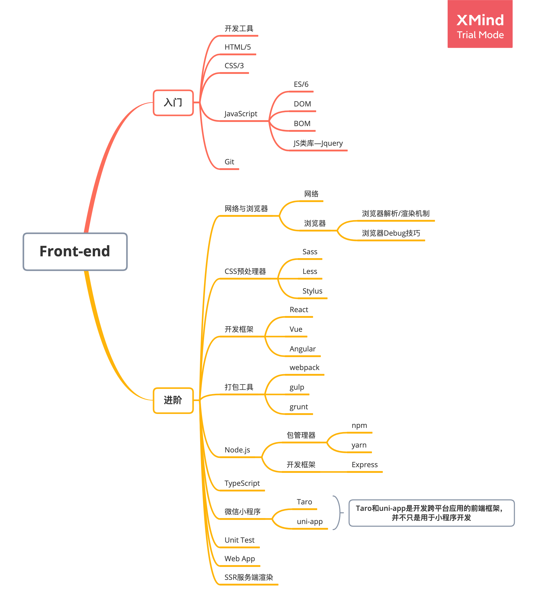

## 
前端学习路线

> 本文写与2020-09-03，文中所写的学习路线是作者目前已经掌握或者了解的内容，纯属个人观点，整个项目也会按照这个路线进行总结。
> 
> 由于前端技术更新迭代速度较快，作者也在不断的学习更多的前端知识，因此整个路线图也会不断的进行更新。

 

### 路线图
整个路线图我将其分为两部分：“入门” & “进阶”。
入门的大部分内容会是我们常说的前端三剑客：HTML、CSS、JavaScript，学习完这部分仅仅只能算是前端入门，离现在大部分公司的要求可能还相差甚远。

但是这部分的内容又是及其重要，甚至可以说是前端开发的核心中，不管是React开发框架、Node.js、微信小程序等都离不开这部分基础部分的知识。因此希望小伙伴们在学习的过程中重视这部分内容。

